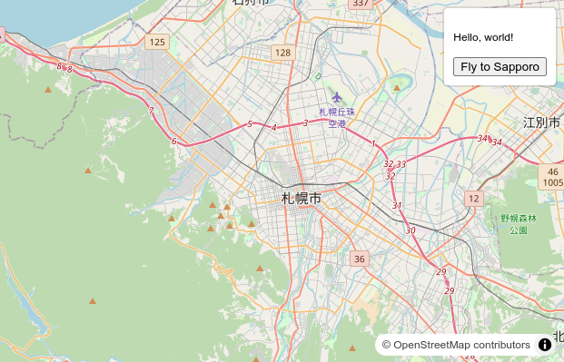

# maplibre-gl-sample-control

This is a sample project that shows how to add a Control to MapLibre GL JS. [demo](https://xiupos.github.io/maplibre-gl-sample-control/)



## Installation

```bash
pnpm add xiupos/maplibre-gl-sample-control
```

## Usege

```js
// Import the plugin
import { SampleControl } from 'maplibre-gl-sample-control';
import 'maplibre-gl-sample-control/dist/style.css';

// const map = new Map({ ... });

map.on('load', () => {
  // Add sample control
  const Sample = new SampleControl({ text: 'Custom text' });
  map.addControl(Sample);
});
```

## Credits

This project is based on [the MapLibre GL JS documentation](https://maplibre.org/maplibre-gl-js/docs/).

## License

This project is licensed under the MIT License.
